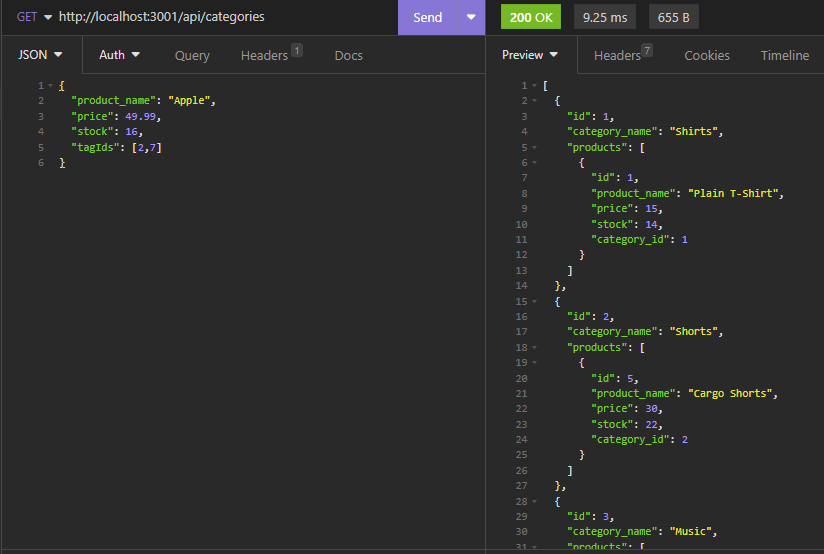

# E-Commerce Back End

## Description 
Created back end for an e-commerce website. Users can use Insomnia to GET routes, POST to each route, perform a PUT for each route, and DELETE an id for each route.

## Table of Contents
1. [Installation](#installation)
2. [Usage](#usage)
3. [Contributing](#contributing)
4. [Tests](#tests)
5. [License](#license)
6. [Questions](#questions)

## Installation
Clone the repo to your local machine, then open the directory in your terminal. Run npm install to install express, sequelize, dotenv, and mysql2. 
You will need to create a .env file and add the database name, MySQL username, and MySQL password (if you have one). 
  
Next, login to mysql and run the schema, then exit mysql. 
  
  

## Usage
Open the terminal, in the command line type - npm run seed - to seed the database. 
Next, type - npm start - to run the program. 
Once the program is running, open Insomnia. Using Insomnia, you can run your api routes GET, POST, PUT, and DELETE.  
  
For an example of the process, please view this video: [Demo Video](https://drive.google.com/file/d/1iaMgh0rQVVaPnNyGPcfTTTc3WdaMckrf/view)

## Contributing
N/A

## Tests
N/A

## License
Licensed under the [MIT license](https://opensource.org/license/mit/)

## Questions
You can view my GitHub repository here: [JenWariner19/ecommerce-back-end](https://github.com/JenWariner19/ecommerce-back-end) 
If you have any questions and would like to contact me, you can email me at: [jenniferwariner@yahoo.com](mailto:jenniferwariner@yahoo.com)